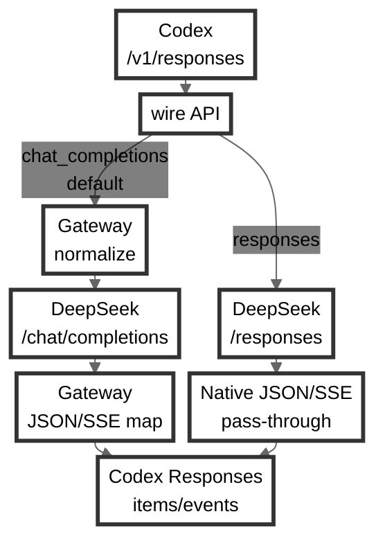

# Codex DeepSeek Gateway

English | [简体中文](README.zh-CN.md)

A lightweight local gateway that lets Codex use DeepSeek models while preserving the Codex workflow. Codex continues to send OpenAI `Responses API` requests. By default, the gateway maps them to DeepSeek-compatible `Chat Completions` and converts the results back; optionally, it forwards requests in DeepSeek's official Responses-compatible format. Tools, reasoning, streaming, and session replay keep working while tool execution, history, and resume remain owned by Codex.



Core strengths include:

- Codex tools, including parallel calls and tools revealed during a session through `tool_search`.
- A packaged model catalog that registers DeepSeek models and reasoning levels with Codex, enabling `/model` switching and features that validate model names, such as native sub-agents.
- High cache hit rates: request construction is tuned for DeepSeek context caching to reduce cost and response latency in multi-turn sessions.
- Web search: optional Tavily and Firecrawl backends support Codex web-search requests.
- Vision bridging: Codex image attachments and `view_image` results are converted into reusable text reports for DeepSeek.
- Tuned system prompts: bilingual system prompts and personalities adapted for DeepSeek.
- Stronger compaction that produces a schema-validated checkpoint from bridged Chat or native Responses history, with a deterministic trusted fallback when compaction cannot complete safely.

Package: [@galaxy-yearn/codex-deepseek-gateway](https://www.npmjs.com/package/@galaxy-yearn/codex-deepseek-gateway)

## Requirements

- [Node.js](https://nodejs.org/en/download) 22 or newer
- [DeepSeek API key](https://platform.deepseek.com/api_keys)
- [Codex CLI](https://developers.openai.com/codex) 0.144.0 or newer

## Install

Install the package and copy the runtime into `~/.codex/deepseek-gateway`:

```sh
npm install -g @galaxy-yearn/codex-deepseek-gateway
codex-deepseek-gateway --version          # confirm the installed version (short form: -v)
codex-deepseek-gateway install            # a first install opens the config file automatically
codex-deepseek-gateway install --no-edit  # install without opening the config file
```

Put your DeepSeek API key in `~/.codex/deepseek-gateway/config/gateway.local.json`:

```json
{
  "upstreamApiKey": "sk-..."
}
```

`install` never overwrites existing settings in `gateway.local.json`; when upgrading an older install it adds the missing `upstreamWireApi` key with the backwards-compatible `chat_completions` default.

## Configure the Codex Provider

Every usage method needs this provider entry in `~/.codex/config.toml`. The gateway installer does not create it, so add the block yourself (create the file if needed) and restart any running Codex:

```toml
[model_providers.deepseek-gateway]
name = "DeepSeek"
base_url = "http://127.0.0.1:3000/v1"
wire_api = "responses"
```

There are two supported ways to select the gateway.

### Plain `codex` with the Packaged Catalog

To make DeepSeek the normal Codex provider, add the top-level model settings and point `model_catalog_json` at the installed English or Chinese catalog:

```toml
model_provider = "deepseek-gateway"
model = "deepseek-v4-flash"
model_reasoning_effort = "high"
model_catalog_json = "~/.codex/deepseek-gateway/config/model-catalog.json"
```

Then run `codex` normally. Use `model-catalog.zh.json` in the path for the Chinese prompts, model descriptions, reasoning descriptions, and personalities. With `model_catalog_json` configured, plain Codex loads the same packaged models and metadata as the gateway launcher.

### Gateway Launcher alongside Another Provider

To keep another provider as your normal Codex default, leave its top-level `model_provider`, `model`, and related settings unchanged. The `codex-deepseek-gateway new` and `sessions` commands need only the `deepseek-gateway` provider block above; for that Codex process they inject the selected provider, model, reasoning effort, reasoning-summary settings, and packaged `model_catalog_json`. This lets the gateway coexist with another provider without replacing your default Codex configuration.

## Start and Check

Start the gateway and check it:

```sh
codex-deepseek-gateway start
codex-deepseek-gateway status
```

`status` should show `Gateway status: HEALTHY`.

Use these commands and diagnostics to operate and inspect the installed gateway:

- `codex-deepseek-gateway status` — performs a fast local health check. `HEALTHY` means the installed, running, and CLI versions agree, the recorded process is authenticated, and its actual local API endpoint is reachable.
- `codex-deepseek-gateway doctor` — extends the status check across the complete Codex → gateway → DeepSeek path, including configuration, listener security, provider setup, bilingual catalog alignment, `/v1/models`, DeepSeek authentication, reasoning cache, and optional web backends. It reports `OK`, `WARNING`, or `FAIL` with a direct fix, and never sends a completion or calls Tavily/Firecrawl.
- `codex-deepseek-gateway stop` — gracefully stops the recorded gateway instance after authenticating it. It refuses to terminate a process whose identity cannot be verified.
- `codex-deepseek-gateway stop --force` — forcibly stops the recorded PID. Use it only after checking `~/.codex/deepseek-gateway/gateway.pid` and confirming that the process belongs to this gateway installation.
- Debug log — set `"debugPayload": true` in `gateway.local.json` to write per-request mapping and orchestration summaries to `~/.codex/deepseek-gateway/gateway.debug.log`. It helps diagnose request conversion, model/reasoning mapping, tools, streaming, web search, and compaction without changing gateway behavior. The log rotates at 5 MB; install and upgrade preserve existing logs, and old files can be deleted manually.

Both `status` and `doctor` accept `--json` for stable structured output. Restart the gateway after changing `gateway.local.json` by running `stop` and then `start`. Repeated compact fallback diagnostics or request-boundary errors right after an upgrade usually mean the session was open during the upgrade; exit and reopen the session (see Upgrade).

## Use with Codex

For the launcher path, start Codex with:

```sh
codex-deepseek-gateway new       # start a new conversation
codex-deepseek-gateway sessions  # pick and resume a session from the current project
```

Both commands launch Codex with the provider overrides described above and load the packaged model catalog: the DeepSeek models, system prompts, reasoning levels, and personalities that ship with the gateway.

Useful non-interactive forms:

```sh
codex-deepseek-gateway new --model deepseek-v4-flash --reasoning-effort low
codex-deepseek-gateway sessions --print             # list resume commands
codex-deepseek-gateway sessions --all               # include sessions from all projects
codex-deepseek-gateway sessions --exec <id-or-row>  # resume by row number or session id
```

Whenever the packaged catalog is loaded, whether through plain `codex` or the launcher, `/model` switches between the DeepSeek models and reasoning levels, and `/personality` switches between the catalog personalities.

### Upstream Wire API

The gateway keeps its existing Responses-to-Chat bridge by default. To send `/v1/responses` requests directly to DeepSeek's native Responses API, set this in `gateway.local.json`:

```json
{
  "upstreamWireApi": "responses"
}
```

`chat_completions` is the default and provides the reasoning cache, apply-patch compatibility, and optional local Web Search loop. `responses` retains the packaged catalog and compaction handling while forwarding other Responses requests and native JSON/SSE events directly to DeepSeek. `/v1/chat/completions` remains a pass-through in either mode.

### Language

Set `codexPromptLanguage` in `~/.codex/deepseek-gateway/config/gateway.local.json`:

```json
{
  "codexPromptLanguage": "zh"
}
```

`en` (the default) makes the launcher inject the English catalog and use the English `new` / `sessions` picker interface; `zh` uses the Chinese catalog and picker copy. Invalid values fall back to `en`. Plain `codex` uses whichever catalog file its `model_catalog_json` names. Neither option translates Codex's own native TUI. Catalog changes require reopening the Codex session.

### Models and Reasoning

The selected catalog is the single installed model inventory: its model slugs drive the launcher, the gateway `/v1/models` endpoint, and the default same-name DeepSeek mappings.

The gateway ships two model IDs, `deepseek-v4-flash` and `deepseek-v4-pro`. The packaged catalog exposes exactly three reasoning levels aligned with DeepSeek V4:

| Reasoning level | Meaning | DeepSeek request |
| --- | --- | --- |
| `low` | Light reasoning | `thinking.type = enabled`, `reasoning_effort = low` |
| `high` | Deep reasoning | `thinking.type = enabled`, `reasoning_effort = high` |
| `max` | Maximum reasoning | `thinking.type = enabled`, `reasoning_effort = max` |

`low` is lighter reasoning, not no-thinking mode. `high` is the default; `max` is intended for the most complex agentic work.

To disable thinking, set Codex's `model_reasoning_effort` to `none` in `config.toml`, or override it for one plain Codex launch:

```sh
codex -c 'model_reasoning_effort="none"'
```

`none` is a Codex request override rather than a reasoning level advertised by the DeepSeek model catalog, so it does not appear in `/model` or the gateway launcher picker. The gateway maps it to `thinking.type = disabled` and omits `reasoning_effort` from the DeepSeek request.

DeepSeek's chain of thought is shown in full in the Codex TUI, and the raw `reasoning_content` is preserved for model history.

## Vision (Optional)

Vision is off until an API key is configured. The gateway uses a separate OpenAI-compatible vision endpoint to turn Codex image inputs into text evidence for DeepSeek. The recommended and default vision model is `kimi-k3`.

```json
{
  "visionEnabled": true,
  "visionApiKey": "..."
}
```

Codex local attachments become reusable `Vision report` text on the first model request; DeepSeek receives reports instead of historical image data. `view_image` output and direct API images use the same adapter. Images and reports are not persisted.

## Web Search (Optional)

The local Web Search loop is available only with `upstreamWireApi: "chat_completions"`: Tavily performs searches, and optional Firecrawl support adds page reading. In `responses` mode, the gateway instead forwards DeepSeek's native Responses web-search tools and events. The local feature is off by default and provides text evidence only.

Create a [Tavily API key](https://app.tavily.com/home), then enable search:

```json
{
  "tavilyApiKey": "tvly-...",
  "tavilyWebSearchEnabled": true
}
```

If you also want opened-page reading, create a [Firecrawl API key](https://www.firecrawl.dev/app/api-keys), then enable it:

```json
{
  "firecrawlApiKey": "fc-...",
  "firecrawlWebFetchEnabled": true
}
```

## Upgrade

Exit all running Codex sessions before upgrading, then run:

```sh
codex-deepseek-gateway update
```

`update` preserves `gateway.local.json`, updates the package and local runtime, then runs `status` and `doctor`. Reopen Codex sessions after it completes. Interactive commands also suggest `update` when a newer version is available; non-interactive calls skip this check.

## Uninstall

Stop the gateway, remove the local runtime, then remove the global package:

```sh
codex-deepseek-gateway stop
codex-deepseek-gateway uninstall
npm uninstall -g @galaxy-yearn/codex-deepseek-gateway
```

`uninstall` removes the local runtime, including its local configuration and state.

## Command Reference

```sh
codex-deepseek-gateway install    # copy the runtime into ~/.codex/deepseek-gateway
codex-deepseek-gateway update     # update the package and verify the local runtime
codex-deepseek-gateway start      # start the local gateway
codex-deepseek-gateway stop       # stop the local gateway
codex-deepseek-gateway status     # show install, process, and endpoint status
codex-deepseek-gateway doctor     # inspect config and request mapping
codex-deepseek-gateway new        # start a Codex conversation through the launcher
codex-deepseek-gateway sessions   # pick and resume a Codex session
codex-deepseek-gateway uninstall  # remove the local runtime
```

Run `codex-deepseek-gateway --help` for all options.

## Configuration Reference

All settings live in `~/.codex/deepseek-gateway/config/gateway.local.json`. Copy the block below and change what you need; every value shown is the default (`sk-REPLACE_ME` is a placeholder the gateway treats as unset). Each key can also be set as an `UPPER_SNAKE_CASE` environment variable, which takes precedence. Restart the gateway (`stop`, then `start`) after changes.

```json
{
  "upstreamApiKey": "sk-REPLACE_ME",
  "upstreamBaseUrl": "https://api.deepseek.com",
  "upstreamWireApi": "chat_completions",
  "upstreamMaxTokens": 0,
  "visionEnabled": false,
  "visionApiKey": "",
  "visionBaseUrl": "https://api.moonshot.cn/v1",
  "visionModel": "kimi-k3",
  "visionReasoningEffort": "high",
  "visionTimeoutMs": 120000,
  "visionMaxImages": 16,
  "visionMaxImageBytes": 25165824,
  "visionMaxTotalImageBytes": 41943040,
  "visionMaxReportChars": 64000,
  "visionMaxCompletionTokens": 131072,
  "visionCacheTtlMs": 21600000,
  "visionCacheMaxEntries": 128,
  "host": "127.0.0.1",
  "port": 3000,
  "codexPromptLanguage": "en",
  "compactReasoningEffort": "high",
  "compactMaxTokens": 20000,
  "compactTimeoutMs": 240000,
  "reasoningCacheEnabled": true,
  "debugPayload": false,
  "tavilyApiKey": "",
  "tavilyWebSearchEnabled": false,
  "webSearchMaxRounds": 60,
  "firecrawlApiKey": "",
  "firecrawlWebFetchEnabled": false
}
```

- `upstreamApiKey` — your [DeepSeek API key](https://platform.deepseek.com/api_keys) (`DEEPSEEK_API_KEY` also works).
- `upstreamBaseUrl` — DeepSeek API endpoint; see the [DeepSeek API documentation](https://api-docs.deepseek.com/).
- `upstreamWireApi` — `/v1/responses` upstream protocol, `chat_completions` by default or native `responses`; `/v1/chat/completions` remains a Chat pass-through in either mode.
- `upstreamMaxTokens` — cap on DeepSeek output tokens; `0` uses the catalog's default ~100K budget.
- `visionEnabled`, `visionApiKey` — enable Codex image bridging and provide the vision endpoint API key (`VISION_API_KEY` or `MOONSHOT_API_KEY` also works). The example keeps this disabled until a key is configured.
- `visionBaseUrl`, `visionModel` — OpenAI-compatible vision API base URL and model; image input uses base64 Data URLs because public image URLs are not supported.
- `visionReasoningEffort` — vision reasoning effort, `high` by default and configurable as `low`, `high`, or `max`.
- `visionTimeoutMs`, `visionMaxImages`, `visionMaxImageBytes`, `visionMaxTotalImageBytes`, `visionMaxReportChars`, `visionMaxCompletionTokens` — configurable timeout, image, report, and completion limits.
- `visionCacheTtlMs`, `visionCacheMaxEntries` — bounded in-memory cache for successful reports. Replayed attachments and replays of the same tool output reuse their reports; a new `view_image` call ID requests a fresh observation. Images and reports are not persisted.
- `host`, `port` — gateway listen address.
- `codexPromptLanguage` — catalog and picker language injected by the launcher; plain `codex` uses its configured `model_catalog_json`; see [Language](#language).
- `compactReasoningEffort` — thinking effort used for compaction, `high` by default; `max` remains available.
- `compactMaxTokens` — installed checkpoint hard limit; defaults to and is capped at 20000. The harness does not impose a separate DeepSeek generation limit or a smaller checkpoint target.
- `compactTimeoutMs` — total timeout for one compaction model call; defaults to 240000 and is independent of the ordinary upstream request timeout.
- `reasoningCacheEnabled` — set `false` to disable the reasoning cache described below.
- `debugPayload` — log per-request mapping summaries to `gateway.debug.log` (rotated at 5 MB).
- `tavilyApiKey`, `tavilyWebSearchEnabled` — [Tavily](https://docs.tavily.com/documentation/quickstart) web search backend (see Web Search).
- `webSearchMaxRounds` — web search rounds per turn; default `60`, hard cap `80`.
- `firecrawlApiKey`, `firecrawlWebFetchEnabled` — [Firecrawl](https://docs.firecrawl.dev/introduction) page-reading backend (see Web Search).
- `webSearchMaxSearches`, `webSearchMaxPages` — provider-operation budgets per turn; defaults are `30` Tavily searches and `50` Firecrawl page reads, capped at `50` and `80` respectively. Automatic and model-requested page reads share the same page budget.
- `webSearchMaxToolChars`, `webSearchTurnTimeoutMs`, `webSearchConcurrency` — total tool-text, wall-clock, and concurrency budgets; defaults are `240000`, `180000`, and `3`, with tool text capped at `400000` characters.
- `firecrawlMaxAgeMs`, `firecrawlStoreInCache` — Firecrawl freshness and storage policy; the default cache window is two days and fresh Tavily filters automatically use a shorter window.

The install directory also contains `state/reasoning-cache.jsonl`, a bounded cache (default 1000 messages / 16 MB) that restores raw DeepSeek reasoning for tool turns across gateway restarts; it is preserved by `install` and safe to delete.

## Limits

- Chat Completions is not a full Responses API replacement. Codex hosted tools without a local executor are declared to DeepSeek as plain function tools rather than executed; web search is the only hosted tool the gateway executes itself.
- Tavily/Firecrawl web emulation is text-focused and does not claim OpenAI hosted web_search parity for cached/indexed modes, image search content, browser control, screenshots, raw HTML, cookies, crawl jobs, or private-network access.
- OpenAI `file_id` values are passed through; the gateway cannot fetch private OpenAI-hosted files.
- Plain `codex` loads the packaged model catalog only when `model_catalog_json` points to it; the gateway launcher supplies that override automatically.
- After resume, Codex may duplicate the displayed tail of certain long Markdown turns. History is not duplicated; this is an upstream Codex TUI display issue.

## License

MIT. See [LICENSE](LICENSE).
