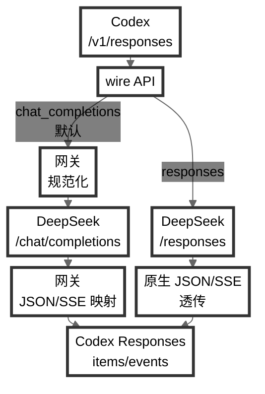

# Codex DeepSeek Gateway

[English](README.md) | 简体中文

一个让 Codex 使用 DeepSeek 模型、同时保留 Codex 工作流的轻量级本地网关。Codex 继续发送 OpenAI `Responses API` 请求。默认情况下，网关将请求映射到 DeepSeek 兼容的 `Chat Completions` 并转换结果；也可以直接按 DeepSeek 官方兼容的 Responses 格式转发。工具、reasoning、流式输出和会话恢复都能照常工作，工具执行、历史与恢复仍由 Codex 管理。



核心优势包括：

- 支持 Codex 工具，包括并行调用和会话中通过 `tool_search` 公开的工具。
- 随包 model catalog：把 DeepSeek 模型与 reasoning 档位注册进 Codex，支持 `/model` 切换以及需要校验模型名的功能，如原生 sub-agents。
- 高缓存命中率：请求构造针对 DeepSeek 上下文缓存进行优化，可降低多轮会话的费用与响应延迟。
- 网络搜索：可选接入 Tavily 和 Firecrawl，支持 Codex 的网络搜索请求，并针对多轮搜索优化效率。
- 视觉桥接：Codex 图片附件和 `view_image` 结果会转换为可复用的文本报告供 DeepSeek 使用。
- 调优的系统提示词：随包提供为 DeepSeek 适配的双语 system prompts 与 personalities。
- 更强的 compact 机制：从桥接后的 Chat 历史或原生 Responses 历史生成通过 schema 校验的 checkpoint；无法安全完成时回退到确定性的可信状态。

软件包：[@galaxy-yearn/codex-deepseek-gateway](https://www.npmjs.com/package/@galaxy-yearn/codex-deepseek-gateway)

## 要求

- [Node.js](https://nodejs.org/en/download) 22 或更新版本
- [DeepSeek API key](https://platform.deepseek.com/api_keys)
- [Codex CLI](https://developers.openai.com/codex) 0.144.0 或更新版本

## 安装

安装软件包，并把运行时复制到 `~/.codex/deepseek-gateway`：

```sh
npm install -g @galaxy-yearn/codex-deepseek-gateway
codex-deepseek-gateway --version          # 确认安装的版本（简写：-v）
codex-deepseek-gateway install            # 首次安装会自动打开配置文件
codex-deepseek-gateway install --no-edit  # 安装但不打开配置文件
```

把你的 DeepSeek API key 填入 `~/.codex/deepseek-gateway/config/gateway.local.json`：

```json
{
  "upstreamApiKey": "sk-..."
}
```

`install` 不会覆盖 `gateway.local.json` 中已有的设置；从旧版本升级时，只会为缺少该字段的配置补上兼容旧行为的 `upstreamWireApi: "chat_completions"`。

## 配置 Codex Provider

两种使用方式都需要在 `~/.codex/config.toml` 中配置以下 provider。网关安装器不会代为创建；请自行加入该配置块（文件不存在则新建），并重启正在运行的 Codex：

```toml
[model_providers.deepseek-gateway]
name = "DeepSeek"
base_url = "http://127.0.0.1:3000/v1"
wire_api = "responses"
```

选择网关有以下两种方式。

### 普通 `codex` 加载随包 Catalog

如需让 DeepSeek 成为普通 Codex 的默认 provider，请添加顶层模型设置，并让 `model_catalog_json` 指向安装后的英文或中文 catalog：

```toml
model_provider = "deepseek-gateway"
model = "deepseek-v4-flash"
model_reasoning_effort = "high"
model_catalog_json = "~/.codex/deepseek-gateway/config/model-catalog.json"
```

然后直接运行 `codex`。如需中文 prompts、模型与 reasoning 描述以及 personalities，把路径中的文件名改成 `model-catalog.zh.json`。配置 `model_catalog_json` 后，普通 Codex 会加载与网关 launcher 相同的随包模型和元数据。

### Gateway Launcher 与其他 Provider 并用

如需保留另一个 provider 作为普通 Codex 的默认值，请保持其顶层 `model_provider`、`model` 等设置不变。`codex-deepseek-gateway new` 和 `sessions` 只要求上面的 `deepseek-gateway` provider 块；它们会为本次 Codex 进程注入所选 provider、模型、reasoning 强度、reasoning summary 设置和随包 `model_catalog_json`。因此网关可以与另一个 provider 同时配置，而不替换普通 Codex 的默认 provider。

## 启动与检查

启动网关并检查状态：

```sh
codex-deepseek-gateway start
codex-deepseek-gateway status
```

`status` 应显示 `Gateway status: HEALTHY`。

以下命令和诊断信息用于管理并检查已经安装的网关：

- `codex-deepseek-gateway status` — 执行快速本机健康检查。`HEALTHY` 表示 CLI、已安装运行时和实际运行进程的版本一致，记录中的进程通过身份认证，并且实际使用的本地 API 端点可达。
- `codex-deepseek-gateway doctor` — 在 `status` 基础上检查完整的 Codex → 网关 → DeepSeek 链路，包括网关配置、监听安全、Codex provider、中英文 catalog 对齐、`/v1/models`、DeepSeek 身份认证、reasoning cache 和可选网络后端。它会给出 `OK`、`WARNING` 或 `FAIL` 及直接修复建议，不会发送 completion，也不会调用 Tavily/Firecrawl。
- `codex-deepseek-gateway stop` — 验证进程身份后，正常停止记录中的网关实例；无法确认身份时不会终止该进程。
- `codex-deepseek-gateway stop --force` — 强制停止记录中的 PID。只应在核对 `~/.codex/deepseek-gateway/gateway.pid` 并确认该进程确实属于当前网关安装后使用。
- 调试日志 — 在 `gateway.local.json` 中设置 `"debugPayload": true`，即可把每次请求的映射与编排摘要写入 `~/.codex/deepseek-gateway/gateway.debug.log`。它用于排查请求转换、模型与 reasoning 映射、工具调用、流式输出、网络搜索和 compact，不会改变网关行为。日志达到 5 MB 时轮转；安装与升级会保留现有日志，旧文件可手动删除。

`status` 和 `doctor` 都支持 `--json`，用于输出稳定的结构化报告。修改 `gateway.local.json` 后，应先运行 `stop`，再运行 `start` 重启网关。更新后连续出现 compact fallback 诊断或请求边界错误，通常是更新时会话仍处于打开状态；退出并重开该会话即可（见「版本更新」一节）。

## 在 Codex 中使用

使用 launcher 路径时，通过以下命令启动 Codex：

```sh
codex-deepseek-gateway new       # 开始新对话
codex-deepseek-gateway sessions  # 从当前项目选择并恢复会话
```

这两个命令会用上文的 provider 覆盖配置启动 Codex，并加载随包 model catalog：随网关一起分发的 DeepSeek 模型、system prompts、reasoning 档位和 personalities。

常用的非交互形式：

```sh
codex-deepseek-gateway new --model deepseek-v4-flash --reasoning-effort low
codex-deepseek-gateway sessions --print             # 列出恢复命令
codex-deepseek-gateway sessions --all               # 包含所有项目的会话
codex-deepseek-gateway sessions --exec <id-or-row>  # 按行号或 session id 直接恢复
```

无论通过普通 `codex` 还是 launcher，只要加载了随包 catalog，Codex TUI 中的 `/model` 就能切换 DeepSeek 模型和 reasoning 档位，`/personality` 可以切换 catalog 提供的 personality。

### 上游 Wire API

网关默认保留现有的 Responses → Chat Completions 桥接。要让 `/v1/responses` 直接接入 DeepSeek 原生 Responses API，可在 `gateway.local.json` 中设置：

```json
{
  "upstreamWireApi": "responses"
}
```

`chat_completions` 是默认值，提供 reasoning cache、apply-patch 兼容和可选的本地网络搜索循环。`responses` 保留随包 catalog 和 compact 处理，其余 Responses 请求及原生 JSON/SSE 事件直接转发给 DeepSeek。无论使用哪种模式，`/v1/chat/completions` 都保持直通。

### 语言

在 `~/.codex/deepseek-gateway/config/gateway.local.json` 中设置 `codexPromptLanguage`：

```json
{
  "codexPromptLanguage": "zh"
}
```

`en`（默认）让 launcher 注入英文 catalog，并使用英文 `new` / `sessions` 选择界面；`zh` 使用中文 catalog 和选择界面。无效值回退到 `en`。普通 `codex` 使用其 `model_catalog_json` 路径指定的 catalog 文件。两种方式都不会翻译 Codex 自身的原生 TUI；切换 catalog 后需要重开 Codex 会话。

### 模型与 Reasoning

当前选中的 catalog 是安装后唯一的模型清单：其中的模型 slug 同时驱动 launcher、网关 `/v1/models` 端点以及默认的 DeepSeek 同名模型映射。

网关提供两个模型 ID：`deepseek-v4-flash` 和 `deepseek-v4-pro`。随包 catalog 直接提供与 DeepSeek V4 对齐的三个 reasoning 档位：

| Reasoning 档位 | 含义 | DeepSeek 请求 |
| --- | --- | --- |
| `low` | 轻量推理 | `thinking.type = enabled`，`reasoning_effort = low` |
| `high` | 深度推理 | `thinking.type = enabled`，`reasoning_effort = high` |
| `max` | 最大推理强度 | `thinking.type = enabled`，`reasoning_effort = max` |

`low` 表示轻量推理，不是关闭思考；`high` 是默认档位，`max` 面向最复杂的 Agent 任务。

如需关闭思考，请在 `config.toml` 中把 Codex 的 `model_reasoning_effort` 设为 `none`，或只对一次普通 Codex 启动进行覆盖：

```sh
codex -c 'model_reasoning_effort="none"'
```

`none` 是 Codex 的请求覆盖值，不是 DeepSeek model catalog 对外声明的 reasoning 档位，因此不会出现在 `/model` 或网关 launcher 的选择器中。网关会把它映射成 `thinking.type = disabled`，并从 DeepSeek 请求中省略 `reasoning_effort`。

DeepSeek 的思维链会在 Codex TUI 中完整显示，原始 `reasoning_content` 同时为模型历史保留。

## 视觉能力（可选）

视觉能力在配置 API key 前保持关闭。网关通过独立的 OpenAI 兼容视觉端点，把 Codex 的图片输入转换成供 DeepSeek 使用的文本证据。推荐和默认的视觉模型是 `kimi-k3`。

```json
{
  "visionEnabled": true,
  "visionApiKey": "..."
}
```

Codex 本地附件会在首次模型请求时转换为可复用的 `Vision report` 文本；DeepSeek 接收报告，不接收历史图片数据。`view_image` 返回的图片和直接 API 图片使用同一适配器。图片和报告不会持久化。

## 网络搜索（可选）

本地网络搜索循环仅适用于 `upstreamWireApi: "chat_completions"`：Tavily 负责搜索，可选的 Firecrawl 提供页面读取。使用 `responses` 时，网关改为透传 DeepSeek 原生 Responses 的网络搜索工具和事件。本地搜索默认关闭，并且只提供文本证据。

先获取 [Tavily API key](https://app.tavily.com/home)，再启用搜索：

```json
{
  "tavilyApiKey": "tvly-...",
  "tavilyWebSearchEnabled": true
}
```

如果还需要打开页面读取，先获取 [Firecrawl API key](https://www.firecrawl.dev/app/api-keys)，再启用该功能：

```json
{
  "firecrawlApiKey": "fc-...",
  "firecrawlWebFetchEnabled": true
}
```

## 版本更新

更新前先退出所有正在运行的 Codex 会话，然后运行：

```sh
codex-deepseek-gateway update
```

`update` 会保留 `gateway.local.json`，更新软件包和本地运行时，然后运行 `status` 与 `doctor`。完成后重新打开 Codex 会话。交互式命令发现新版本时也会提示运行 `update`；非交互式调用会跳过检查。

## 卸载

先停止网关，再删除本地运行时，最后卸载全局软件包：

```sh
codex-deepseek-gateway stop
codex-deepseek-gateway uninstall
npm uninstall -g @galaxy-yearn/codex-deepseek-gateway
```

`uninstall` 会删除本地运行时及其中的本地配置和状态。

## 命令速查

```sh
codex-deepseek-gateway install    # 把运行时复制到 ~/.codex/deepseek-gateway
codex-deepseek-gateway update     # 更新软件包并检查本地运行时
codex-deepseek-gateway start      # 启动本地网关
codex-deepseek-gateway stop      # 停止本地网关
codex-deepseek-gateway status     # 显示安装、进程和端点状态
codex-deepseek-gateway doctor     # 检查配置和请求映射
codex-deepseek-gateway new        # 通过 launcher 启动 Codex 对话
codex-deepseek-gateway sessions   # 选择并恢复 Codex 会话
codex-deepseek-gateway uninstall  # 删除本地运行时
```

运行 `codex-deepseek-gateway --help` 查看全部选项。

## 配置参考

所有设置位于 `~/.codex/deepseek-gateway/config/gateway.local.json`。复制下面的代码块并按需修改；所示值即默认值（`sk-REPLACE_ME` 是占位符，网关会视作未设置）。每个键也可用 `UPPER_SNAKE_CASE` 形式的环境变量设置（环境变量优先）。修改后重启网关（先 `stop` 再 `start`）。

```json
{
  "upstreamApiKey": "sk-REPLACE_ME",
  "upstreamBaseUrl": "https://api.deepseek.com",
  "upstreamWireApi": "chat_completions",
  "upstreamMaxTokens": 0,
  "visionEnabled": false,
  "visionApiKey": "",
  "visionBaseUrl": "https://api.moonshot.cn/v1",
  "visionModel": "kimi-k3",
  "visionReasoningEffort": "high",
  "visionTimeoutMs": 120000,
  "visionMaxImages": 16,
  "visionMaxImageBytes": 25165824,
  "visionMaxTotalImageBytes": 41943040,
  "visionMaxReportChars": 64000,
  "visionMaxCompletionTokens": 131072,
  "visionCacheTtlMs": 21600000,
  "visionCacheMaxEntries": 128,
  "host": "127.0.0.1",
  "port": 3000,
  "codexPromptLanguage": "en",
  "compactReasoningEffort": "high",
  "compactMaxTokens": 20000,
  "compactTimeoutMs": 240000,
  "reasoningCacheEnabled": true,
  "debugPayload": false,
  "tavilyApiKey": "",
  "tavilyWebSearchEnabled": false,
  "webSearchMaxRounds": 60,
  "firecrawlApiKey": "",
  "firecrawlWebFetchEnabled": false
}
```

- `upstreamApiKey` — 你的 [DeepSeek API key](https://platform.deepseek.com/api_keys)（也可用 `DEEPSEEK_API_KEY`）。
- `upstreamBaseUrl` — DeepSeek API 端点；参见 [DeepSeek API 文档](https://api-docs.deepseek.com/)。
- `upstreamWireApi` — `/v1/responses` 的上游协议，默认 `chat_completions`，也可设为原生 `responses`；无论该值如何，`/v1/chat/completions` 都保持 Chat 直通。
- `upstreamMaxTokens` — DeepSeek 输出 token 上限；`0` 表示使用 catalog 的默认约 100K 预算。
- `visionEnabled`、`visionApiKey` — 开启 Codex 图片桥接并配置视觉端点 API key（也可使用 `VISION_API_KEY` 或 `MOONSHOT_API_KEY`）。示例默认关闭，配置 key 后再开启。
- `visionBaseUrl`、`visionModel` — OpenAI 兼容视觉 API 的基址和模型；图片输入使用 base64 Data URL，不支持公网图片 URL。
- `visionReasoningEffort` — 视觉推理强度，默认 `high`，可配置为 `low`、`high` 或 `max`。
- `visionTimeoutMs`、`visionMaxImages`、`visionMaxImageBytes`、`visionMaxTotalImageBytes`、`visionMaxReportChars`、`visionMaxCompletionTokens` — 可配置的超时、图片、报告和输出边界。
- `visionCacheTtlMs`、`visionCacheMaxEntries` — 成功报告的有界内存缓存。历史附件及同一工具结果的重放复用已有报告；新的 `view_image` call ID 表示主动重新观察。图片和报告均不持久化。
- `host`、`port` — 网关监听地址。
- `codexPromptLanguage` — launcher 注入的 catalog 与选择器语言；普通 `codex` 使用其配置的 `model_catalog_json`；见[语言](#语言)。
- `compactReasoningEffort` — 压缩使用的 thinking effort，默认 `high`，仍可使用 `max`。
- `compactMaxTokens` — 安装后 checkpoint 的硬上限，默认且最高为 20000；harness 不另行限制 DeepSeek 的生成额度，也不设置更小的 checkpoint 目标。
- `compactTimeoutMs` — 单次 compact 模型调用的总时限，默认 240000 ms，与普通上游请求时限相互独立。
- `reasoningCacheEnabled` — 设为 `false` 可关闭下文的 reasoning cache。
- `debugPayload` — 把每次请求的映射摘要写入 `gateway.debug.log`（5 MB 轮转）。
- `tavilyApiKey`、`tavilyWebSearchEnabled` — [Tavily](https://docs.tavily.com/documentation/quickstart) 网络搜索后端（见「网络搜索」）。
- `webSearchMaxRounds` — 单轮对话内的网络搜索轮数，默认 `60`，硬上限 `80`。
- `firecrawlApiKey`、`firecrawlWebFetchEnabled` — [Firecrawl](https://docs.firecrawl.dev/introduction) 页面读取后端（见「网络搜索」）。
- `webSearchMaxSearches`、`webSearchMaxPages` — 每 turn 的 provider 操作预算，默认分别为 `30` 次 Tavily 搜索和 `50` 次 Firecrawl 页面抓取，硬上限分别为 `50` 和 `80`。自动抓取和模型主动抓取共享同一个页面预算。
- `webSearchMaxToolChars`、`webSearchTurnTimeoutMs`、`webSearchConcurrency` — 工具文本总量、总时限和并发预算，默认分别为 `240000`、`180000`、`3`；工具文本硬上限为 `400000` 字符。
- `firecrawlMaxAgeMs`、`firecrawlStoreInCache` — Firecrawl 新鲜度和存储策略；默认缓存窗口为两天，Tavily 的新鲜度过滤会自动使用更短窗口。

安装目录下还会保留 `state/reasoning-cache.jsonl`：这是一个有界缓存（默认 1000 条消息 / 16 MB），用于在网关重启后还原工具轮次的 DeepSeek 原始 reasoning；`install` 会保留，也可随时安全删除。

## 局限

- Chat Completions 不是完整的 Responses API 替代品。没有本地 executor 的 Codex hosted tools 只会以普通 function tool 的形式声明给 DeepSeek，而不会被执行；网络搜索是网关唯一亲自执行的 hosted tool。
- Tavily/Firecrawl 的网络搜索模拟以文本为中心，不承诺 OpenAI hosted web_search 的 cached/indexed 模式、图片搜索内容、浏览器控制、截图、原始 HTML、cookies、crawl jobs 或私有网络访问。
- OpenAI `file_id` 值会原样透传；网关无法获取 OpenAI 托管的私有文件。
- 普通 `codex` 仅在 `model_catalog_json` 指向随包文件时加载该 catalog；网关 launcher 会自动注入这个覆盖参数。
- 恢复会话后，Codex 可能重复显示特定长 Markdown 轮次的尾部。历史本身没有重复；这是上游 Codex TUI 的显示问题。

## 许可证

MIT。见 [LICENSE](LICENSE)。
